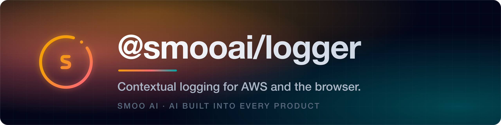
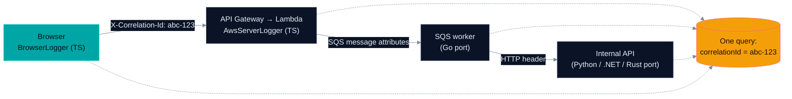

<p align="center">
  <a href="https://smoo.ai"></a>
</p>

<p align="center">
  <a href="https://www.npmjs.com/package/@smooai/logger"></a>
  <a href="https://pypi.org/project/smooai-logger/"></a>
  <a href="https://crates.io/crates/smooai-logger"></a>
  <a href="https://www.nuget.org/packages/SmooAI.Logger"></a>
</p>

<p align="center">
  <a href="https://smoo.ai"></a>
  <a href="./LICENSE"></a>
</p>

<p align="center">
  <a href="https://github.com/SmooAI/logger/actions/workflows/pr-checks.yml"></a>
  <a href="https://github.com/SmooAI/logger/actions/workflows/release.yml"></a>
</p>

<p align="center">
  
  
  
  
  
</p>

<p align="center">
  <a href="#what-is-this"><b>What it is</b></a> &nbsp;·&nbsp;
  <a href="#feature-tour"><b>Feature tour</b></a> &nbsp;·&nbsp;
  <a href="#-install"><b>Install</b></a> &nbsp;·&nbsp;
  <a href="#-quickstart"><b>Quickstart</b></a> &nbsp;·&nbsp;
  <a href="#one-schema-five-ports"><b>Language matrix</b></a> &nbsp;·&nbsp;
  <a href="#-part-of-smoo-ai"><b>Platform</b></a>
</p>

---

> **A log line that only carries the message is a clue. One that carries the whole story is an answer.** `@smooai/logger` stamps every entry with the request journey (correlation IDs across services), the AWS runtime around it (Lambda, SQS, API Gateway context), and — where an OpenTelemetry span is active — the _real_ W3C trace and span IDs, so logs join your traces instead of floating beside them. Native ports in **five languages** — TypeScript, Python, Rust, Go, and .NET — emit the same JSON shape, so a request crossing language boundaries still reads as one story.

Traditional loggers give you the message, but not the story. `@smooai/logger` records where the log came from, the request journey that led there, and the runtime around it — so a production failure reads like a trace, not a guess.

---

## What is this?

One structured-logging schema, implemented natively five times. Each port is idiomatic in its own language, but the wire shape — level names, `correlationId`, `http.request/response`, `user`, `telemetry`, error serialization — is shared, so logs from a TypeScript Lambda, a Go worker, a Python API, a Rust service, and a .NET job land in the same queries.

- **TypeScript** ([`src/`](src/)) — the original. AWS server logging plus the only **browser** logger (device/browser detection, fetch correlation).
- **Python** ([`python/`](python/)) — full port, plus [Socket.IO and Uvicorn logging adapters](python/src/smooai_logger/).
- **Rust** ([`rust/logger/`](rust/logger/)) — serde-based port; Lambda context helpers behind an `aws-lambda` feature flag.
- **Go** ([`go/`](go/)) — full port on `log/slog`, including Lambda/SQS helpers and OTel span correlation.
- **.NET** ([`dotnet/`](dotnet/src/SmooAI.Logger/)) — full port; integrates with `Microsoft.Extensions.Logging`, trace correlation via `System.Diagnostics.Activity`.

The ports are **not** all identical — the honest capability matrix is [below](#one-schema-five-ports).

---

## Feature tour

|     | Capability                                                                                | Where                                           |
| --- | ----------------------------------------------------------------------------------------- | ----------------------------------------------- |
| 🔗  | [**Correlation across services**](#-correlation-across-services)                          | All 5 languages                                 |
| ⚡  | [**AWS context, captured automatically**](#-aws-context-captured-automatically)           | All 5 languages                                 |
| 🔭  | [**Logs that join your traces**](#-logs-that-join-your-traces)                            | TS · Python · Rust · Go (+ .NET via `Activity`) |
| 📍  | [**Exact caller location**](#-exact-caller-location)                                      | All 5 languages                                 |
| 🎨  | [**Pretty local output + rotating file logs**](#-pretty-local-output--rotating-file-logs) | All 5 languages                                 |
| 🕶️  | [**Sensitive-key redaction**](#-sensitive-key-redaction)                                  | All 5 languages                                 |
| 🖥️  | [**Browser logging**](#-browser-logging)                                                  | TypeScript only                                 |

### 🔗 Correlation across services

A correlation ID set (or extracted from an incoming header, Lambda event, or SQS record) follows the request everywhere, in every language:

```typescript
// Service A: API Gateway handler (TypeScript)
logger.addLambdaContext(event, context);
logger.info("Request received"); // correlationId: abc-123

// Service B: SQS processor (extracts the ID from the record)
logger.addSQSRecordContext(record);
logger.info("Processing message"); // same correlationId: abc-123
```

```go
// Service C: a Go worker — same schema, same ID
l.AddHTTPRequest(logger.HTTPRequest{
    Headers: map[string]string{"X-Correlation-Id": "abc-123"},
})
l.Info("Completing workflow", logger.Map{"orderId": "ord_1"}) // still abc-123
```



### ⚡ AWS context, captured automatically

Hand the logger the Lambda event/context (or SQS record, or HTTP request) once; every subsequent line carries the invocation metadata — function, region, request IDs, HTTP method/path/headers, SQS attributes.

```typescript
import { AwsServerLogger } from "@smooai/logger/AwsServerLogger";

const logger = new AwsServerLogger({ name: "UserAPI" });

export const handler = async (event, context) => {
  logger.addLambdaContext(event, context);

  try {
    const user = await createUser(event.body);
    logger.info("User created successfully", { userId: user.id });
    return { statusCode: 201, body: JSON.stringify(user) };
  } catch (error) {
    logger.error("Failed to create user", error, { body: event.body });
    throw error;
  }
};
```

The same helpers exist in each port: `add_lambda_context` ([Python](python/README.md)), `NewLambdaLogger` / `AddSQSRecordContext` ([Go](go/README.md)), `AddLambdaContext` ([.NET](dotnet/src/SmooAI.Logger/README.md)), and Lambda environment/event helpers behind the `aws-lambda` feature ([Rust](rust/logger/README.md)).

### 🔭 Logs that join your traces

Historically every line's `traceId` was a fabricated UUID — useless for joining logs to traces. Now, when an OpenTelemetry span is active, **TypeScript, Python, Rust, and Go stamp the span's real W3C `trace_id` and `span_id`** onto the line, matching what your tracing backend recorded. No active span → the UUID fallback, unchanged.

```go
// Go: thread the context and the active span's IDs land on the line
l.InfoContext(ctx, "Order shipped", logger.Map{"orderId": "ord_1"})
// → { "traceId": "4bf92f35…", "spanId": "00f067aa…", … }
```

Each port depends only on the OTel **API** (no SDK, no exporter). **.NET is the one exception**: it takes no OpenTelemetry dependency at all and reads the same real W3C IDs from `System.Diagnostics.Activity.Current` — the API OTel .NET itself builds on — so the output is equivalent.

### 📍 Exact caller location

Every entry includes where in the code it was emitted, in all five languages:

```jsonc
{
  "callerContext": {
    "stack": [
      "at UserService.createUser (/src/services/UserService.ts:42:16)",
      "at processRequest (/src/handlers/userHandler.ts:15:23)",
    ],
  },
}
```

Two shapes are in play, and the difference is deliberate:

| shape                                          | ports              | how                                       |
| ---------------------------------------------- | ------------------ | ----------------------------------------- |
| `callerContext.stack` — multiple frames        | TypeScript, Python | walks the runtime stack                   |
| `caller: { file, line, function }` — one frame | Go, Rust, .NET     | zero-cost compile-time / `runtime.Caller` |

```jsonc
{ "caller": { "file": "UserService.cs", "line": 42, "function": "CreateUser" } }
```

Rust omits `function`: `#[track_caller]` gives file and line for free, but `std::panic::Location`
carries no symbol name and resolving one would mean capturing a backtrace on every line. .NET uses
`[CallerFilePath]`/`[CallerLineNumber]`/`[CallerMemberName]`, which the compiler fills in at each
call site — no `StackTrace` walk. Both emit the file **basename** only; the full path is
build-machine noise.

### 🎨 Pretty local output + rotating file logs

All five ports detect local development and switch from strict JSON lines to ANSI pretty-printing — and write logs to disk under `.smooai-logs/` with size/interval-based rotation:

```typescript
const logger = new AwsServerLogger({
  prettyPrint: true, // auto-enabled locally
  rotation: { size: "10M", interval: "1d", compress: true },
});
```

### 🕶️ Sensitive-key redaction

Every port scrubs values whose keys match a redaction list (case-insensitive, recursive) before a line is emitted — `password`, `token`, `authorization`, and friends by default, extensible per logger (`addRedactKeys` / `add_redact_keys` / `DefaultRedactKeys`…).

### 🖥️ Browser logging

**TypeScript only.** `BrowserLogger` captures device type, browser name/version, platform, and user agent, and correlates fetches to your backend logs:

```typescript
import { BrowserLogger } from "@smooai/logger/browser/BrowserLogger";

const logger = new BrowserLogger({ name: "CheckoutFlow" });

const response = await fetch("/api/checkout", {
  method: "POST",
  headers: { "X-Correlation-Id": logger.correlationId() },
});
logger.addResponseContext(response);
logger.info("Checkout completed", { orderId: data.id });
```

---

## 📦 Install

| Language       | Package                                                                               | Install                                                 |
| -------------- | ------------------------------------------------------------------------------------- | ------------------------------------------------------- |
| **TypeScript** | [`@smooai/logger`](https://www.npmjs.com/package/@smooai/logger)                      | `pnpm add @smooai/logger`                               |
| **Python**     | [`smooai-logger`](https://pypi.org/project/smooai-logger/)                            | `pip install smooai-logger` (or `uv add smooai-logger`) |
| **Rust**       | [`smooai-logger`](https://crates.io/crates/smooai-logger)                             | `cargo add smooai-logger`                               |
| **Go**         | [`github.com/SmooAI/logger/go/v4`](https://pkg.go.dev/github.com/SmooAI/logger/go/v4) | `go get github.com/SmooAI/logger/go/v4`                 |
| **.NET**       | [`SmooAI.Logger`](https://www.nuget.org/packages/SmooAI.Logger)                       | `dotnet add package SmooAI.Logger`                      |

## 🚀 Quickstart

TypeScript (the original port — see [AWS context](#-aws-context-captured-automatically) and [browser](#-browser-logging) above for fuller examples):

```typescript
// AWS environments (Lambda, ECS, EC2, …)
import { AwsServerLogger, Level } from "@smooai/logger/AwsServerLogger";

const logger = new AwsServerLogger({ name: "OrderService", level: Level.Info });

logger.addUserContext({ id: "user-123", role: "admin" }); // persists across logs
logger.addTelemetryFields({ duration: 150, operation: "db-query" });
logger.info("Payment processed", { amount: 99.99, currency: "USD" });

try {
  await riskyOperation();
} catch (error) {
  logger.error("Operation failed", error, { context: "additional-info" });
  // → error message, stack trace, error type, and your context
}
```

Six levels in every port — `TRACE` · `DEBUG` · `INFO` · `WARN` · `ERROR` · `FATAL` — plus context presets (`MINIMAL` / `FULL`).

Per-language quickstarts, with full API docs:

- **Python** — [`python/README.md`](python/README.md)
- **Rust** — [`rust/logger/README.md`](rust/logger/README.md)
- **Go** — [`go/README.md`](go/README.md)
- **.NET** — [`dotnet/src/SmooAI.Logger/README.md`](dotnet/src/SmooAI.Logger/README.md)

---

## One schema, five ports

The wire schema is shared; port depth is not identical. Here's the honest status of each surface:

| Capability                              | TypeScript | Python | Rust | Go  | .NET |
| --------------------------------------- | :--------: | :----: | :--: | :-: | :--: |
| Structured JSON, 6 levels               |     ✅     |   ✅   |  ✅  | ✅  |  ✅  |
| Correlation / request / trace IDs       |     ✅     |   ✅   |  ✅  | ✅  |  ✅  |
| HTTP request/response context           |     ✅     |   ✅   |  ✅  | ✅  |  ✅  |
| User context + telemetry fields         |     ✅     |   ✅   |  ✅  | ✅  |  ✅  |
| Lambda / SQS / API Gateway helpers      |     ✅     |   ✅   | ✅ ¹ | ✅  |  ✅  |
| Pretty local output                     |     ✅     |   ✅   |  ✅  | ✅  |  ✅  |
| Rotating file logs (`.smooai-logs/`)    |     ✅     |   ✅   |  ✅  | ✅  |  ✅  |
| Sensitive-key redaction                 |     ✅     |   ✅   |  ✅  | ✅  |  ✅  |
| OTel span → `traceId`/`spanId` stamping |     ✅     |   ✅   |  ✅  | ✅  | ➖ ² |
| Per-line caller location ⁴              |     ✅     |   ✅   |  ✅  | ✅  |  ✅  |
| Browser logger                          |     ✅     |   ❌   |  ❌  | ❌  |  ❌  |
| Parity corpus enforced in tests ³       |     ✅     |   ✅   |  ✅  | ✅  |  ✅  |

¹ Behind the `aws-lambda` cargo feature; Lambda _environment_ context needs no feature.
² No OTel dependency — equivalent real W3C trace/span IDs read from `System.Diagnostics.Activity.Current`, which is the API OpenTelemetry .NET itself builds on. Log lines also tee upstream via `SmooLoggerOptions.ForwardTo` (an `ILogger`), the hook OTel's .NET log appender attaches to.
³ [`parity-corpus.json`](parity-corpus.json) is the cross-language output contract, and **all five** ports now replay it from that one committed file — TypeScript ([`src/parity-corpus.spec.ts`](src/parity-corpus.spec.ts)), Python ([`python/tests/test_parity_corpus.py`](python/tests/test_parity_corpus.py)), Rust ([`rust/logger/tests/parity_corpus.rs`](rust/logger/tests/parity_corpus.rs)), Go ([`go/parity_corpus_test.go`](go/parity_corpus_test.go)), and .NET ([`dotnet/tests/SmooAI.Logger.Tests/ParityCorpusTests.cs`](dotnet/tests/SmooAI.Logger.Tests/ParityCorpusTests.cs)). It covers level mapping, required field names, message shape, correlation-id propagation, and the default redaction key list. Editing a corpus value turns all five suites red.
⁴ Two shapes: TypeScript and Python emit a multi-frame `callerContext.stack`; Go, Rust and .NET emit a single-frame `caller` object. Rust's omits `function` — see [Exact caller location](#-exact-caller-location).

**CI does cover all five languages on every PR** ([`pr-checks.yml`](.github/workflows/pr-checks.yml) typechecks, lints, tests, and builds TS, Python, Rust, Go, and .NET), and [`release.yml`](.github/workflows/release.yml) publishes all five: npm → PyPI → crates.io → Go module tag → NuGet.

---

## 🔎 Looking for the desktop Log Viewer?

It moved. The Rust/egui log viewer that used to live here has been rebuilt as **SmooAI Observability Studio** — a Dioxus native desktop client for SmooAI logs, errors, and metrics — and lives in the [SmooAI/observability](https://github.com/SmooAI/observability) repo (`desktop/`), with builds on its [releases page](https://github.com/SmooAI/observability/releases). The crate has been deleted from this repo; see [`log-viewer/DEPRECATED.md`](log-viewer/DEPRECATED.md) for the migration story.

## 🧩 Part of Smoo AI

`@smooai/logger` is built and open-sourced by **[Smoo AI](https://smoo.ai)** — the AI-powered business platform with AI built into every product: CRM, customer support, campaigns, field service, observability, and developer tools.

- 🧰 **More open source from Smoo AI** — [smoo.ai/open-source](https://smoo.ai/open-source)
- 🧩 **Sibling packages** — [@smooai/fetch](https://github.com/SmooAI/fetch), [@smooai/config](https://github.com/SmooAI/config), [@smooai/observability](https://github.com/SmooAI/observability), [smooth](https://github.com/SmooAI/smooth)

Use them in your stack, or take them as a reference for how we build.

## 🤝 Contributing

Contributions are welcome. This project uses [changesets](https://github.com/changesets/changesets) to manage versions and releases — add one with `pnpm changeset`, then open a pull request referencing any related issues.

## 📄 License

MIT © SmooAI. See [LICENSE](LICENSE).

## Contact

Brent Rager

- [Email](mailto:brent@smoo.ai)
- [LinkedIn](https://www.linkedin.com/in/brentrager/)
- [BlueSky](https://bsky.app/profile/brentragertech.bsky.social)
- [TikTok](https://www.tiktok.com/@brentragertech)
- [Instagram](https://www.instagram.com/brentragertech/)

Smoo GitHub: [github.com/SmooAI](https://github.com/SmooAI)

---

<p align="center">
  Built by <a href="https://smoo.ai"><strong>Smoo AI</strong></a> — AI built into every product.
</p>
